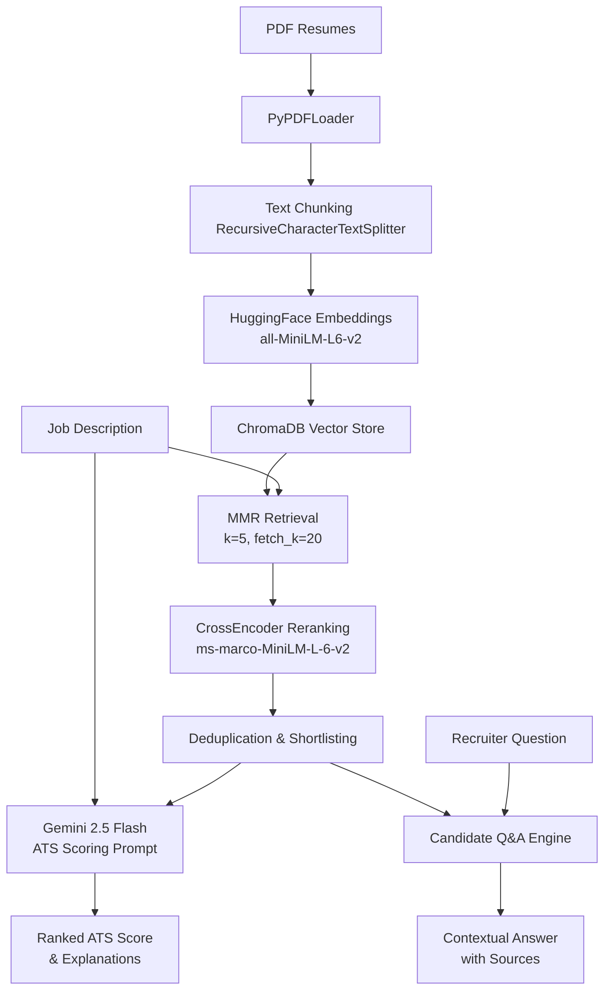

# AI Resume Matcher 🎯

An enterprise-ready, AI-powered Resume Screening & Candidate Matching System built using **LangChain**, **Retrieval-Augmented Generation (RAG)**, and **Google Gemini 2.5 Flash**. 

This system automates candidate vetting by parsing multiple resumes, matching them against job descriptions with explainable scoring, and allowing recruiters to ask natural-language questions about candidates.

---

## 🛠️ Architecture & Pipeline Flow

The system utilizes a modern hybrid search and RAG architecture to optimize speed, relevance, and accuracy:



---

## ✨ Key Features

*   **✅ Automated Resume Screening**
    Significantly reduces manual profile vetting time by using semantic match scoring.
*   **✅ ATS-Style Candidate Ranking**
    Generates realistic relevance scores (0–100%) against job descriptions rather than simple binary matches.
*   **✅ Semantic Search**
    Matches candidate experience based on conceptual meaning, synonym usage, and intent rather than plain keyword searches.
*   **✅ AI Candidate Q&A**
    Recruiters can query the system in natural language about shortlisted candidates (e.g., comparing skills, experience levels).
*   **✅ Explainable & Auditable Results**
    Every match score includes clear, model-generated evidence showing why the candidate is (or isn't) a match.

---

## 🧠 Resume Scoring Methodology

To ensure maximum match accuracy and prevent model bias, our ranking pipeline uses a multi-tier logic:

1.  **Extraction**: Extract high-fidelity text from PDFs.
2.  **Chunking**: Break text into overlapping chunks of 500 characters to keep context intact.
3.  **Vector Retrieval**: Create semantic vectors via HuggingFace's `all-MiniLM-L6-v2`. Run Maximal Marginal Relevance (MMR) search to fetch candidate profiles that are both highly relevant and diverse.
4.  **Reranking**: Rescore the retrieved documents using the `ms-marco-MiniLM-L-6-v2` CrossEncoder model to evaluate exact query-document relevance.
5.  **Deduplication**: Group chunks back to their parent resume files.
6.  **LLM Scoring & Evidence Synthesis**: Contextualize the shortlisted resumes inside a structured prompt and invoke Gemini 2.5 Flash to generate structured JSON containing ratings, matched skills, missing skills, and evidence.

---

## 💡 Sample Use Cases & Queries

### Example Job Descriptions / Vetting Goals:
*   *"Rank candidates for a Data Scientist role with Python, PyTorch, and SQL experience."*
*   *"Find a Software Engineer with Linux, C++, and Embedded Systems knowledge."*

### Interactive Recruiter Questions (Q&A Panel):
*   💬 *"Which candidate has the strongest cloud/AWS experience?"*
*   💬 *"Summarize the top 3 resumes highlighting their leadership skills."*
*   💬 *"Compare candidate 60004873.pdf and candidate 61579998.pdf regarding their Docker experience."*

---

## 📸 Screenshots

### Dashboard


### Candidate Ranking


### AI Resume Q&A


---

## 📂 Project Structure

```
resume_matcher/
├── backend/
│   ├── __init__.py
│   ├── main.py          # FastAPI REST endpoints
│   ├── pipeline.py      # Singleton RAG pipeline coordinator
│   └── schemas.py       # Pydantic validation models
├── frontend/
│   └── streamlit_app.py # Premium dark-mode Streamlit Dashboard
├── src/                 # Core LangChain pipeline modules
│   ├── embeddings.py
│   ├── llm.py
│   ├── pdf_loader.py
│   ├── qa_engine.py
│   ├── rag_chain.py
│   ├── reranker.py
│   ├── resume_loader.py
│   ├── retriever.py
│   ├── text_splitter.py
│   └── vector_store.py
├── data/
│   └── resumes/         # Source folder for PDF uploads
├── chroma_db/           # Local vector database storage
├── .env                 # API keys & Configuration
├── requirements.txt
├── run_backend.bat      # One-click FastAPI launcher (Windows)
└── run_frontend.bat     # One-click Streamlit launcher (Windows)
```

---

## 🚀 Setup & Execution

### 1. Create & Activate Virtual Environment
```bash
python -m venv venv
venv\Scripts\activate
```

### 2. Install Dependencies
```bash
pip install -r requirements.txt
```

### 3. Configure API Keys
Create a `.env` file in the root directory:
```env
GOOGLE_API_KEY=your_gemini_api_key_here
```

### 4. Running the Application
Open two separate terminals and launch using the batch files:

*   **Terminal 1 (Backend)**:
    ```bash
    run_backend.bat
    ```
*   **Terminal 2 (Frontend)**:
    ```bash
    run_frontend.bat
    ```

---

## 🔌 API Endpoints (FastAPI)

Access the interactive API documentation (Swagger UI) at `http://localhost:8000/docs`.

| Method | Endpoint | Description |
|---|---|---|
| **GET** | `/health` | Live service health check |
| **GET** | `/candidates` | Retrieve a list of all uploaded resumes |
| **POST** | `/upload-resumes` | Upload new PDF resumes into RAG storage |
| **POST** | `/match` | Run matching pipeline against a job description |
| **POST** | `/qa` | Query candidate resumes in natural language |

---

## 🚀 Roadmap / Future Enhancements

*   [ ] Resume parsing using OCR (Tesseract) for scanned images/PDFs.
*   [ ] Multi-Job Description comparison matrix.
*   [ ] Automated interview question generator based on candidate skill gaps.
*   [ ] Skill gap visual charts for candidate feedback.
*   [ ] Direct email integration/notification system for recruiter workflows.
*   [ ] Dockerized deployment (`docker-compose`).
*   [ ] Authentication, RBAC (Role-Based Access Control) for HR teams.
